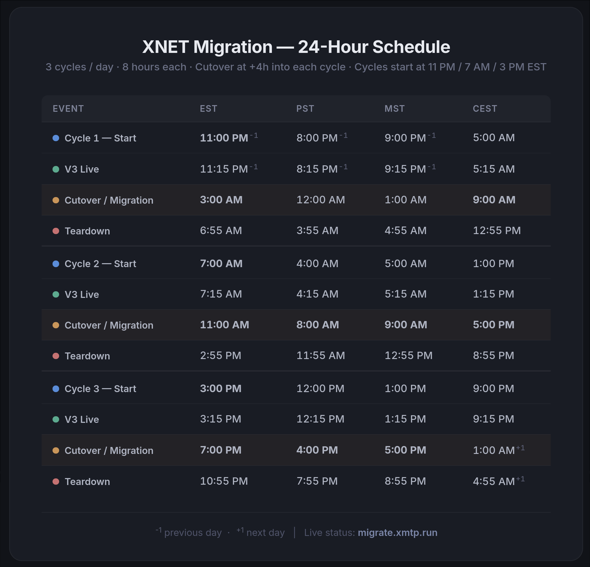

# Ephemeral Xnet Deploy Tool

[](https://github.com/xmtplabs/xnet-public/actions/workflows/check.yml)
[](https://github.com/xmtplabs/xnet-public/actions/workflows/start.yml)
[](https://github.com/xmtplabs/xnet-public/actions/workflows/teardown.yml)

Deploys an ephemeral [xnet](https://github.com/xmtp/xmtpd) instance to Hetzner for testing the v3 to d14n migration. Provisions a full network stack, runs for ~8 hours, executes the cutover, then tears down and repeats.

Live status: [migrate.xmtp.run](http://migrate.xmtp.run)

## Schedule

3 cycles/day, 8 hours each, cutover at +4h into each cycle.



## Development

### Prerequisites

- [Nix](https://nixos.org/download.html) with flakes enabled
- SSH key registered on the Hetzner account (default name: `insipx-hetzner`)
- `HCLOUD_TOKEN` environment variable set

### Enter nix environment

```bash
nix develop
```

This provides `nixos-anywhere`, `jq`, and `hcloud`.

### Test in QEMU VM

```bash
nix run .#vm
```

Requires `sudo` for port 80 binding. Status page accessible at `http://localhost:8080`. Cutover set to 5 minutes from boot.

### Provision

```bash
SSH_KEY_PATH=~/.ssh/your_key ./dev/provision
```

| Variable | Default | Description |
|---|---|---|
| `SSH_KEY_PATH` | *required* | Path to SSH private key (must match key on Hetzner account) |
| `CUTOVER_DELAY_MINUTES` | `240` (4h) | Minutes after provision before cutover triggers |
| `SLACK_WEBHOOK_URL` | *(optional)* | Slack incoming webhook for migration notifications |
| `LOCATION` | `hil` | Hetzner datacenter location |
| `SERVER_TYPE` | `cpx51` | Hetzner server type |

Example with 15-minute cutover for testing:

```bash
SSH_KEY_PATH=~/.ssh/hetzner_id CUTOVER_DELAY_MINUTES=15 ./dev/provision
```

### Teardown

```bash
SSH_KEY_PATH=~/.ssh/your_key ./dev/teardown
```

Skip log collection:

```bash
NO_LOGS=true SSH_KEY_PATH=~/.ssh/your_key ./dev/teardown
```

### GitHub Actions

Workflows run automatically on a cron schedule. Trigger manually:

```bash
gh workflow run start.yml
gh workflow run teardown.yml
```

## Configuration map

Config lives in three layers. Each layer owns what naturally belongs there — nothing is duplicated.

| What | Where | How to change |
|---|---|---|
| **Hetzner server, domain, region, cutover, Slack** | `flake.nix` + `modules/xnet-status/default.nix` (NixOS options under `services.xnet-status.*` and `services.xnet.*`) | Edit `flake.nix` and redeploy (`./dev/provision`). Exposed knobs: `domain`, `region`, `serverType`, `publicScheme`, `remote_domain`, contracts / v3 / xmtpd versions. |
| **xnet-status runtime config** (ports, Prometheus URL, Docker socket, TLS flag) | `modules/xnet-status/default.nix` renders `/etc/xnet/status.toml` at deploy time | Add/edit Nix options, not the TOML directly. The TOML is generated. |
| **Phase enum values** (`awaiting_cutover`, `migrating`, `d14n_active`, etc.) | `services/xnet-status/src/phase.rs` | Rust-side constants. Match the `TRIGGER_PHASES` in the Worker after any rename. |
| **Cloudflare Worker — poll URL, GH target, trigger phase set** | `services/xnet-phase-watcher/wrangler.jsonc` (`vars` block) | Edit and `wrangler deploy`. Use wrangler `env` blocks for multiple environments: `wrangler deploy --env staging`. |
| **Worker secrets** (`GITHUB_TOKEN`) | Cloudflare Worker secrets, not the repo | `wrangler secret put GITHUB_TOKEN`. Documented in `services/xnet-phase-watcher/README.md`. |
| **GitHub Actions schedules / workflow target** | `.github/workflows/*.yml` | Edit the workflow files. The Worker dispatches whichever workflow `GH_WORKFLOW` names. |
| **Development cutover time (VM)** | `modules/set-vm-cutover.nix` | 5 minutes from boot; edit if a different test cadence helps. |
| **Provision-time overrides** (per-run, not persistent) | `dev/provision` env vars | See table above — `CUTOVER_DELAY_MINUTES`, `SLACK_WEBHOOK_URL`, etc. |

Rule of thumb: **NixOS options are for what runs on Hetzner, `wrangler.jsonc` is for what runs on Cloudflare, workflow files are for what runs on GitHub.** If you find yourself wanting a shared config file read by all three, stop and pick the layer that most naturally owns the value — they ship on different cadences and a shared file couples the deploys.
